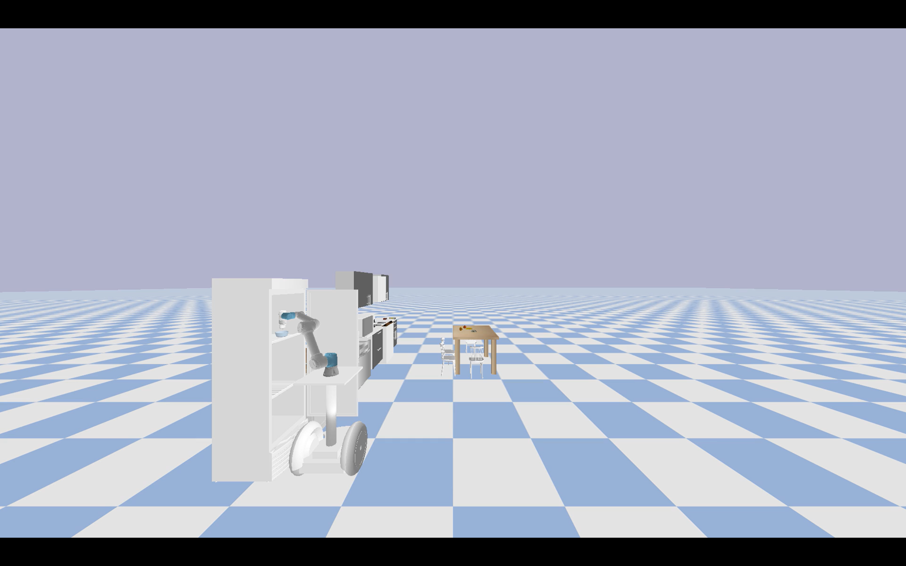

<p align="center">
  
</p>

## MoMa-Pos: Where Should Mobile Manipulators Stand in Cluttered Environment Before Task Execution?
[Beichen Shao](https://github.com/ssspeg)<sup>1</sup>, [Yan Ding](https://yding25.com/)<sup>2</sup> 

<sup>1</sup> Chongqing University, <sup>2</sup> Binghamton University

[Project Page](https://yding25.com/MoMa-Pos/) | [Arxiv](https://arxiv.org/abs/2403.19940)

<div style="display: flex; justify-content: center;">  
    
    
    
</div>  

### Installation

Clone the repository and initialize submodules:

```
git clone https://github.com/AutonoBot-Lab/Project_MoMa-Pos.git
git submodule init
git submodule update
```
Install the OMPL package:

[Download the latest OMPL release.](https://github.com/ompl/ompl/releases/tag/prerelease)

```
pip3 install pygccxml==2.2.1.
cd BestMan_Pybullet/package_OMPL
pip3 install ompl-1.6.0-cp38-cp38-manylinux_2_28_x86_64.whl
```
### Main Project Structure
```
├── Kitchen_models
├── MoMa_Pos
│   ├── MoMa_main.py
│   ├── ...
├── URDF_models
├── URDF_robot
│   ├── segbot.urdf
│   ├── ur5e.urdf
│   └── ...
└── utils
    ├── pb_ompl.py
    ├── utils_Bestman.py
    ├── utils_sample_R.py
    ├── utils_Potential_R.py
```

## Basic Demos

Run a basic demo:
```
python3 ./MoMa_Pos/MoMa_main.py
```
And you can change the position of bowl(element_H2) in 
```
utils/utils_Kitchen2
```
Then you can see these demos:
## Attention
The current code's parameter input is not written succinctly. We will address this by refining the code encapsulation in subsequent updates
