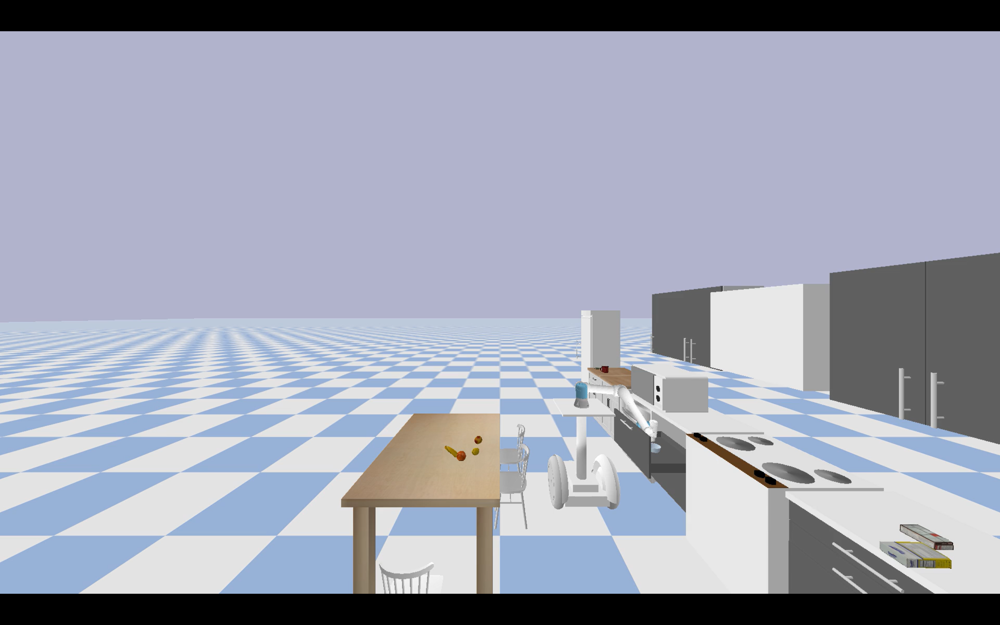

<p align="center">
  
</p>

## :earth_africa: MoMa-Pos: Where Should Mobile Manipulators Stand in Cluttered Environment Before Task Execution?
[Beichen Shao](https://github.com/ssspeg)<sup>1</sup>, [Yan Ding](https://yding25.com/)<sup>2</sup>, Xingchen Wang<sup>1</sup>, Xuefeng Xie<sup>3</sup>, Fuqiang Gu<sup>1</sup>, Jun Luo<sup>4</sup>, [Chao Chen](http://www.cs.cqu.edu.cn/info/1274/3804.htm)<sup>4</sup>  

<sup>1</sup> College of Computer Science,Chongqing University, <sup>2</sup> Binghamton University  
<sup>3</sup> School of Management Science and Real Estate, Chongqing University  
<sup>4</sup> State Key Laboratory of Mechanical Transmission for Advanced Equipment, Chongqing University  


[Project Page](https://yding25.com/MoMa-Pos/) | [Arxiv](https://arxiv.org/abs/2403.19940)

<div style="display: flex; justify-content: center;">  
    
    
    
</div>  


## 💻 Installation  


Clone the repository and initialize submodules:

```
git clone https://github.com/AutonoBot-Lab/Project_MoMa-Pos.git
git submodule init
git submodule update
```
Install the OMPL package:

[Download the latest OMPL release.](https://github.com/ompl/ompl/releases/tag/prerelease)

```
pip3 install pygccxml==2.2.1.
cd BestMan_Pybullet/package_OMPL
pip3 install ompl-1.6.0-cp38-cp38-manylinux_2_28_x86_64.whl
```
## :books: Main Project Structure
```
├── Kitchen_models
├── MoMa_Pos
│   ├── MoMa_main.py
│   ├── ...
├── URDF_models
├── URDF_robot
│   ├── segbot.urdf
│   ├── ur5e.urdf
│   └── ...
└── utils
    ├── pb_ompl.py
    ├── utils_Bestman.py
    ├── utils_sample_R.py
    ├── utils_Potential_R.py
```

## 👨‍💻 Basic Demos

Run a basic demo:
```
python3 ./MoMa_Pos/MoMa_main.py
```
And you can change the position of bowl(element_H2) in 
```
utils/utils_Kitchen_v2
```
Then you can see Bowl in different shelves of the fridge:  
<div style="display: flex; justify-content: center;">  
    
    
</div>    

Bowl in different positions in Drawer:  
<div style="display: flex; justify-content: center;">  
    
    
</div> 

## :pencil2: Attention
The current code's parameter input is not written succinctly. We will address this by refining the code encapsulation in subsequent updates  

## 🚀 Reference
If you find this work useful, please consider citing:  
```
@article{shao2024task,
  title={MoMa-Pos: Where Should Mobile Manipulators Stand in Cluttered Environment Before Task Execution?},
  author={Shao, Beichen and Ding, Yan and Wang, Xingchen and Xie, Xuefeng and Gu, Fuqiang and Luo, Jun and Chen, Chao},
  journal={arXiv preprint arXiv:2403.19940},
  year={2024}
}
```
